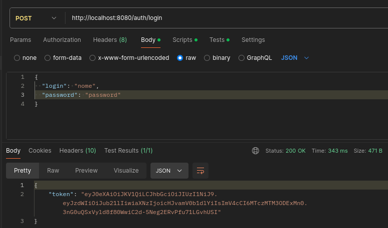
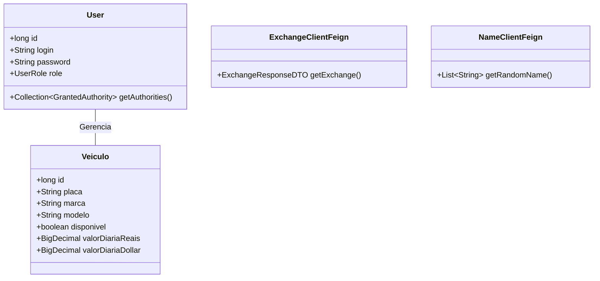
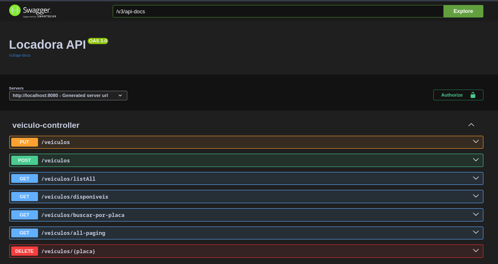

# Sistema de Aluguel de Veículos
Este é um sistema de gerenciamento de veículos desenvolvido como parte do 
programa Ada Tech. A aplicação lida com o processo de administração de 
veículos e exibe o valor da diária tanto em reais quanto em dólar, 
utilizando uma [API de cotações](https://docs.awesomeapi.com.br/api-de-moedas) para obter a taxa de câmbio diária..

<p align="center">
     <a alt="Java" href="https://java.com" target="_blank">
        
    </a>
    <a alt="Spring Boot" href="https://spring.io/projects/spring-boot" target="_blank">
        
    </a>
     <a alt="Maven" href="https://maven.apache.org/index.html" target="_blank">
        
    </a>
    <a alt="H2 database" href="https://www.h2database.com/html/main.html"  target="_blank">
        
    </a>
    <a alt="Swagger" href="https://swagger.io/"  
target="_blank">
        
    </a>
     <a alt="IntelliJ IDEA" href="https://www.jetbrains.com/idea/" target="_blank">
        
    </a>
</p>

## Visão Geral do Projeto

O sistema permite:

* Cadastro e gerenciamento de veículos e usuários.
* Processamento de valores de diária em múltiplas moedas.
* Integração com APIs para obtenção de cotações e geração de dados.
* Implementação de autenticação com JWT para segurança.

---

## Sumário
 
- [Como Executar os testes](#testes)
- [Funcionalidades](#funcionalidades)
- [Diagrama de Classes](#diagrama-de-classes)
- [Regras de Negócio](#regras-de-negócio)
- [Acesso ao Projeto](#acesso-ao-projeto)
- [Testes da API](#testes-da-api)
- [Autores](#autores)

---
## Testes

O projeto possui uma cobertura abrangente de testes, com a implementação de testes unitários e testes de integração, garantindo a qualidade e o funcionamento correto das funcionalidades desenvolvidas. Também é utilizado uma pipeline de Integração Contínua (CI) configurado no GitHub Actions para automatizar a execução dos testes em cada push ou pull request para a branch main.

Para executar os testes do projeto, você pode optar por utilizar uma IDE ou a linha de comando com Maven

### Executando os testes pela IDE

1. Certifique-se de que o projeto está aberto em uma IDE compatível.
2. Navegue até a pasta src/test/java.
3. Clique com o botão direito sobre o pacote de testes (projetoWeb)
4. Selecione a opção "Run Tests in \'ProjetoWeb\'"

### Executando os testes pelo Maven

1. Certifique-se de estar no diretório raiz do projeto (onde o arquivo pom.xml está localizado) => Depois de clonar o projeto, você pode precisar navegar até a pasta projetoWeb dentro de projetoWeb, onde encontra-se o pom.xml.
```
cd projetoWeb
```

2. No terminal, execute o seguinte comando:
```
mvn test
```

3. O Maven executará todos os testes definidos no projeto e exibirá o resultado no terminal.


---
## Funcionalidades

### Gerenciamento de Veículos:
- Cadastro, edição e exclusão de veículos, evitando duplicação.
- Atualização da disponibilidade dos veículos para locação.

### Cotações de Câmbio:
- Conversão de valores em reais para dólar utilizando a API de câmbio.

### Autenticação:
- Validação de login com autenticação JWT.
- Implementação de papéis de usuário.
<br>



### APIs Externas Integradas:
- [API de Câmbio](https://docs.awesomeapi.com.br/api-de-moedas) para obter a taxa USD-BRL.
- [Gerador de Nomes](https://gerador-nomes.wolan.net/) para gerar nomes de usuários.

---

## Diagrama de Classes


---
## Regras de Negócio

1. **Cadastro de Veículos**: Não é permitido cadastrar veículos com a mesma 
   placa.
2. **Consulta de Taxa de Câmbio**: O valor da diária em dólar é calculado a partir 
do valor em reais, baseado na taxa do dia.
3. **Autenticação**: Apenas usuários autenticados têm acesso às operações de 
   cadastro e consulta de veículos.
---
## Acesso ao projeto

Para executar o projeto:

1. Clone o repositório.
```bash    
    ` git clone git@github.com:iagooteles/projetoFinalAdaLocadoraMod5.git` 
```
2. Certifique-se de ter o Java 21 e o Maven configurados.
3. Execute o comando:
``` bash
mvn spring-boot:run
```
---
### Testes da API
Este projeto permite a interação com a API de duas formas:

1. **Swagger**
A documentação da API está disponível no [Swagger](http://localhost:8080/swagger-ui/index.html#/), permitindo que os endpoints sejam visualizados e testados diretamente pelo navegador. Isso facilita a exploração da API sem a necessidade de uma ferramenta externa.
<br>


2. **Postman**
Para visulização e testes através do Postman, o arquivo ´locadora-veiculos-spring.postman_collection.json´, contém todos os endpoints mapeados para facilitar os testes. Bastaimportar esse arquivo no Postman e acessar os endpoints diretamente.


## Autores
<table>
  <tr>
    <td align="center">
      <a href="https://github.com/AlissonRafSilva">
        <br />
        <sub><b>Alisson Silva</b></sub>
      </a>
    </td>
    <td align="center">
      <a href="https://github.com/biancasanches-dev">
        <br />
        <sub><b>Bianca Sanches</b></sub>
      </a>
    </td>
    <td align="center">
      <a href="https://github.com/Elisabete-MO">
        <br />
        <sub><b>Elisabete Oliveira</b></sub>
      </a>
    </td>
    <td align="center">
      <a href="https://github.com/iagooteles">
        <br />
        <sub><b>Iago Teles</b></sub>
      </a>
    </td>
  </tr>
</table>
